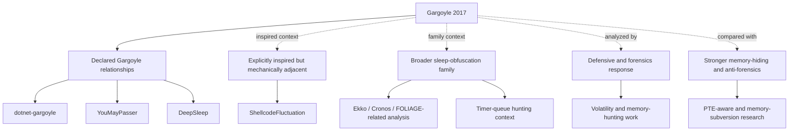

# Lineage

Lineage claims should be conservative. Direct lineage requires source
self-description, not similarity in timers, callbacks, sleep behavior, or
memory-protection changes.

## Categories

- Declared Gargoyle relationships: sources that describe themselves as
  Gargoyle-related. This category includes `dotnet-gargoyle`, YouMayPasser, and
  DeepSleep. The claim is relationship, not mechanical identity.
- Explicitly inspired but mechanically adjacent work: ShellcodeFluctuation cites
  Gargoyle as background for cyclic memory-protection changes, but it should not
  be treated as a direct continuation of the original waitable-timer/APC proof.
- Broader sleep-obfuscation family: Ekko, Cronos, FOLIAGE-related analysis,
  timer-queue hunting, and similar work belong here unless a primary source makes
  a narrower Gargoyle lineage claim.
- Defensive and forensics response: Volatility plugin work, memory hunting, and
  timer inspection analyze or respond to the technique. They are not lineage
  claims.
- Stronger memory-hiding and anti-forensics: PTE-aware analysis and
  memory-subversion research are separate from Gargoyle-style protection cycling.
  They may be useful comparison points, but they are not "Gargoyle but stronger."

See [References](references.md) for the annotated source map.
